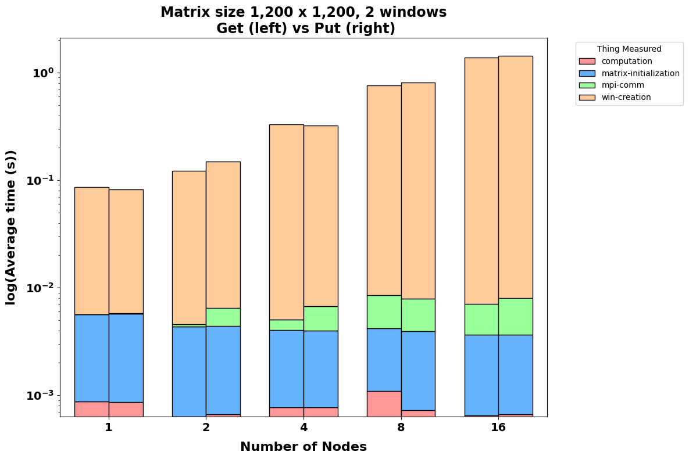
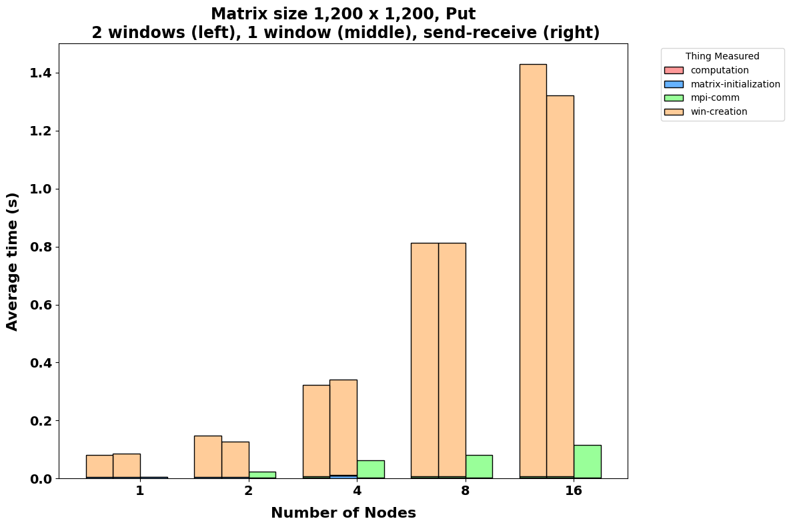
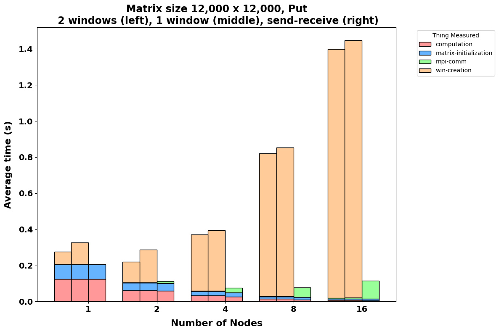

# Jacobi method for solving Laplace equation - RMA approach

## 0. Table of contents

- [1. Description](#1-description)
- [2. How to compile & run](#2-how-to-compile--run)
- [3. Results](#3-results)  

## 1. Description

This folder contains the implementation of the Jacobi method for solving the Laplace equation in a 2D grid. The implementation is based on the **remote memory access (RMA)** approach, using the MPI standard.\
The presented code is the same presented in the folder [`jacobi`](../jacobi), but deprived of all the `openACC` directives which are not the focus of this work.

**Requirements:** It was asked to implement the Jacobi method, but using `MPI` one-sided communication. By design this may be not the most efficient way to solve the problem,\
it has to be considered as a theoretical exercise.

**Implementation**: Depending on how the code is compiled, the behavior of the code can change a lot. In particular:

- A "standard" implementation with no RMA is provided. This differs from the one presented in the [previous exercise](../jacobi/jacobi.c) because the ` MPI_Sendrecv` functions were replaced by `MPI_Isend` and `MPI_Irecv` functions.
- The required implementation using RMA. Since no specification was given, I thought that would be interesting to see how the code: 
  - Using `1 MPI_Win` for the whole grid or `2 MPI_Win` (one for the upper row and one for the lower row).
  - Using `MPI_Put` or `MPI_Accumulate` functions.\
    
Hence, all the 4 possible combinations are implemented.

## 2. How to compile & run

The code can be compiled using the `make` command. Before to do that, you can edit the [`Makefile`](./Makefile) to choose the desired implementation (just uncomment the desired line).

A example of file usable to run the code on the [DCGP Leonardo Partition](https://wiki.u-gov.it/confluence/display/SCAIUS/UG3.2.2%3A+LEONARDO+DCGP+UserGuide) is provided in the [`sbatcher.sh`](./sbatcher.sh) file.
Before to run you will need to edit the file name of the results and the number of nodes and tasks.

The code is meant to run asking the resources manager one process per node, assigning all the available cores to the process, in order to maximize the performance parallelizing the code using `openMP` threads.

## 3. Results
>Remark: the result presented here are not affected by the bias described in the general [`README.md`](../README.md) file.

All the following results are the average of 10 runs.

## 3.1. PUT vs GET 

The first thing I wanted to test was if there is any significant difference between using `MPI_Put` or `MPI_Get` functions.

### 3.1.1  1,200 x 1,200 grid

As expected in this case the computation and initialization time become absolutely negligible compared to the communication time, which represent almost the total of the execution time.

From the results obtained with this small matrices, `MPI_Get` function seems to be the best choice, since it is slightly faster than the `MPI_Put` function.

<figcaption>Figure 1: Get vs Put comparison for a 1,200 x 1,200 grid using 1 MPI_Win.</figcaption>

<figcaption>Figure 2: Get vs Put comparison for a 1,200 x 1,200 grid using 2 MPI_Win.</figcaption>

### 3.1.1  12,000 x 12,000 grid

The result seems to be confirmed only for small number of nodes. Scaling up the number of used nodes leads to results in which `MPI_Get` and `MPI_Put`  seems to be almost equivalent.

<figcaption>Figure 1: Get vs Put comparison for a 12,000 x 12,000 grid using 1 MPI_Win.</figcaption>

<figcaption>Figure 2: Get vs Put comparison for a 12,000 x 12,000 grid using 2 MPI_Win.</figcaption>

## 3.2. 1 MPI_Win vs 2 MPI_Win (Vs MPI_Send + MPI_Recv)

Since there seems to be no clear winner between the `MPI_Put` and `MPI_Get` functions, I will consider only the `MPI_Put` function in the following comparison.

The next interesting thing to test is if there is any difference between using `1 MPI_Win` for the whole grid or `2 MPI_Win` (one for the upper row and one for the lower row).
To have a general idea of the performance, and to stress the fact that this is not the best way to solve the problem, I will compare the results with the one obtained using the `MPI_Send` and `MPI_Recv` functions.

The most evident result is how, in this specific case, the RMA approach is significantly slower than the "standard" MPI communication pattern.

However is important to notice that the `RMA` approach it's slower only due to the initialization time, which is not negligible. Since the windows are initialize just one time before the main computation loop, 
increasing the number of iteration (these benchmarks are done with just 100 iterations) could probably lead at some point to a better performance of the `RMA` approach.

### 3.2.1  1,200 x 1,200 grid

<figcaption>Figure 1: 1 MPI_Win vs 2 MPI_Win comparison for a 1,200 x 1,200 grid.</figcaption>

### 3.2.1  12,000 x 12,000 grid

<figcaption>Figure 1: 1 MPI_Win vs 2 MPI_Win comparison for a 12,000 x 12,000 grid.</figcaption>

We can look at it also in the log-log scale:

<figcaption>Figure 1: 1 MPI_Win vs 2 MPI_Win comparison for a 12,000 x 12,000 grid in log scale.</figcaption>

Interesting enough, There is no a clear winner between the `1 MPI_Win` and `2 MPI_Win` cases.
The variability of the results is very high, and enough to not allow to say which is the best.