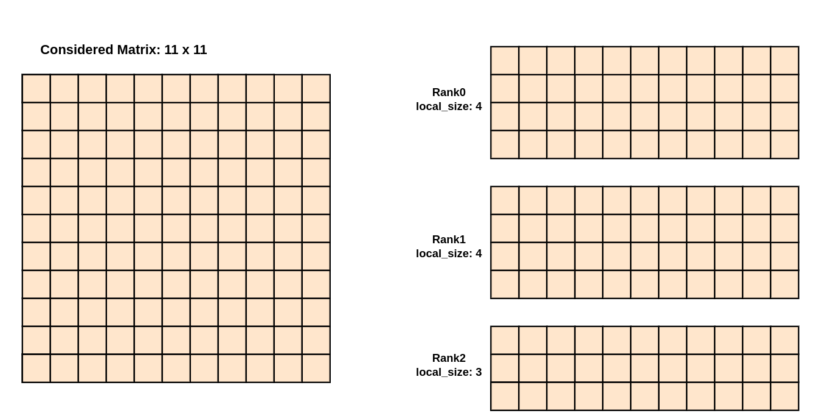
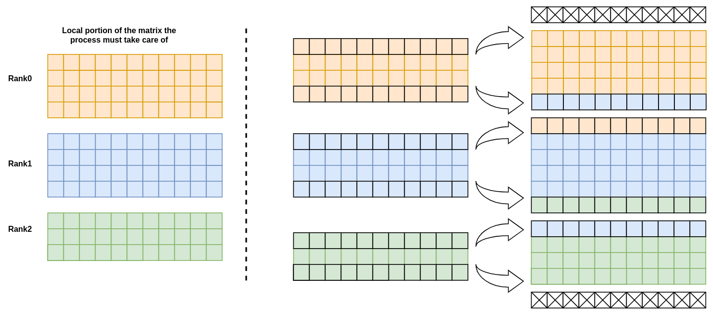
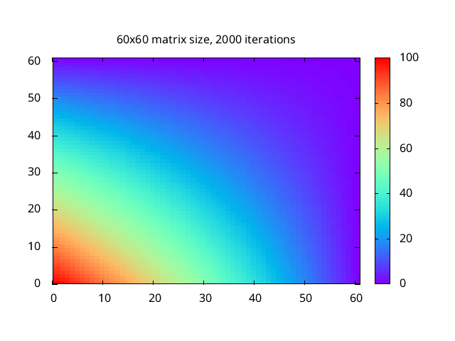

# Jacobi method for solving Laplace equation

## 0. Table of contents

- [1. Description](#1-description)
- [2. Modification to the original code](#2-modification-to-the-original-code)
  - [2.1. OpenMP](#21-openmp)
  - [2.2. OpenMPI](#22-openmpi)
  - [2.3. openACC](#23-openacc)
- [3. Results](#3-results)
  - [3.1 Code correctness](#31-code-correctness)
  - [3.2 CPU performance](#32-cpu-performance)
  - [3.3 GPU performance](#33-gpu-performance)
  

## 1. Description

This folder contains my solution for the given task: taking an already existing code, in this case the [`original_code.c`](./resources/original_code.c) and porting it to the GPU.
To do so I've used the `openACC` library. Moreover, the code has also been modified to implement also `MPI`, in order to distribute the computation among multiple nodes and OpenMP to parallelize the computation among different cores in the same node. 

## 2. Modification to the original code

### 2.1. OpenMP

The OpenMP directive influences the initialization of the matrix and the computation of the values of the matrix for the following iteration.

*Remark:* the parallelization of the *evaluation* in the final code is performed with `openMP` only if `openACC` is not defined, which means that the code is running on the CPU.

### 2.2. OpenMPI

The matrix is divided in blocks, and each blocks is assigned to a process. If the division is not perfect the first processes will take care of the remaining rows.
This is done for both the matrix that is storing the current values of the matrix and the matrix that is storing the values of the matrix for the following iteration (at the end of the iteration the two pointers are swapped).


<figcaption>Figure 1: Division of the matrix among the processes. The matrix is divided in row-wise blocks. The firsts processes may have one more row than the others.</figcaption>

To be more precise, in order to carry on computation, every process need to communicate with the others. Hence the `local_size` values of the previous figure is not the whole memory allocation each process need to have available. In fact each (with except of the first and the last) processes will store two additional more rows, one on the top and one at the bottom. 


<figcaption>Figure 2: MPI-send and MPI-receive operations performed by each process before computing the values of the matrix for the following iteration. Each process will send the first row to the previous process and the last row to the next process. The only exception is the first process that will send only the last row and the last process that will send only the first row.</figcaption>

When the computation is concluded we need to store the results somehow. I have implemented two different ways to do so:

- A faster way, based on `MPI-IO`, in which each process write its own block in the file.
- A slower way, in which the master process collects all the blocks and then writes them in the file using the already existing `save_gnuplot` function.


> **Note**: The second implementation should be avoided. I used that because `MPI-IO` writes binary files and I discovered only later that `gnuplot` was able to interpreter them properly modify the given [`plot.plt`](./plot.plt) file as show in [`plotbin.plt`](./plotbin.plt). The difference in terms of time is huge, even one or two orders of magnitude.

### 2.3. openACC

The code was modified with `openACC` in order to port it on GPU devices. Now the program can be summarized as follows:

- `[cpu]` Initialization of the matrix
- `[cpu->gpu]` Copy the matrix to the GPU
- `[gpu]` Loop over the number of iterations
    - `[gpu]` MPI-send and MPI-receive operations (**Done directly from one GPU to another GPU**)
    - `[gpu]` Computation of the values of the matrix for the following iteration
- `[gpu->cpu]` Copy the matrix back to the CPU
- `[cpu]` Save the matrix in a file

The way this is achieved is by using the `#pragma acc` directive as shown in the following code snippet:

To copy the two needed matrices from host to device and vice-versa:
```c
#pragma acc enter data copyin(matrix[:(dimension+2)*(local_size+2)],matrix_new[:(dimension+2)*(local_size+2)])
{
  for (it = 0; it < iterations; ++it)
  {
    /*
     *    Actual computation of the matrix
     */
  }
}
#pragma acc exit data copyout(matrix[:(dimension+2)*(local_size+2)],matrix_new[:(dimension+2)*(local_size+2)])
```

To perform MPI-send and MPI-receive operations directly from the GPU:
```c
#pragma acc host_data use_device(matrix)
{
  MPI_Sendrecv(matrix + (dimension + 2), dimension + 2, MPI_DOUBLE, send_to, 0, matrix + (dimension+2) * (local_size + 1), dimension+2, MPI_DOUBLE, recv_from, 0, MPI_COMM_WORLD, MPI_STATUS_IGNORE);
  MPI_Sendrecv(matrix + (dimension + 2) * local_size, dimension + 2, MPI_DOUBLE, recv_from, 0, matrix, dimension+2, MPI_DOUBLE, send_to, 0, MPI_COMM_WORLD, MPI_STATUS_IGNORE);
}
```

And finally to be sure the computation is done on the GPU:
```c
 #pragma acc  data present(matrix[:(dimension+2)*(local_size+2)], matrix_new[:(dimension+2)*(local_size+2)])
{
  #pragma acc parallel loop collapse(2)
  for (int i = 1; i <= local_size; ++i)
  {
    for (int j = 1; j <= dimension; ++j)
    {
      matrix_new[(i * (dimension + 2)) + j] = (0.25) *  (matrix[((i - 1) * (dimension + 2)) + j] +
          matrix[(i * (dimension + 2)) + (j + 1)] + matrix[((i + 1) * (dimension + 2)) + j] + matrix[(i * (dimension + 2)) + (j - 1)]);
    }
  }
}
//swap the pointers on the device
#pragma acc serial present(matrix[:(dimension+2)*(local_size+2)],matrix_new[:(dimension+2)*(local_size+2)])
{
  double* tmp_matrix = matrix;
  matrix = matrix_new;
  matrix_new = tmp_matrix;
}
// swap pointer on the host, needed to preserve data consistency
tmp_matrix = matrix;
matrix = matrix_new;
matrix_new = tmp_matrix;
```

We can be sure that the everything is done  as desired by using the `Minfo=acc` flag when compiling the code:
```
mpicc jacobi.c -O3 -Wall -fopenmp -DSTOPWATCH -acc -Minfo=acc -DFASTOUTPUT -o jacobi.x
main:
    158, Generating enter data copyin(matrix_new[:?],matrix[:?])
    181, Generating present(matrix_new[:?],matrix[:?])
         Generating implicit firstprivate(local_size,dimension)
         Generating NVIDIA GPU code
        187, #pragma acc loop gang, vector(128) collapse(2) /* blockIdx.x threadIdx.x */
        189,   /* blockIdx.x threadIdx.x collapsed */
    205, Accelerator serial kernel generated
         Generating implicit private(tmp_matrix)
         Generating NVIDIA GPU code
    229, Generating exit data copyout(matrix_new[:?],matrix[:?])
```

## 3 Results

### 3.1 Code correctness

Running the code with the same parameters as show in the [given reference image](https://github.com/Foundations-of-HPC/Advanced-High-Performance-Computing-2023/tree/main/GPU/Jacobi-project) (matrix size: 60, 2000 iteration) leads to the same results: 



<figcaption>Figure 1: Plot generated with the edited version of the "plot.plt" file.</figcaption>


### 3.2 CPU performance

***TODO*** inserire plottini

### 3.3 GPU performance

***TODO*** inserire plottini
