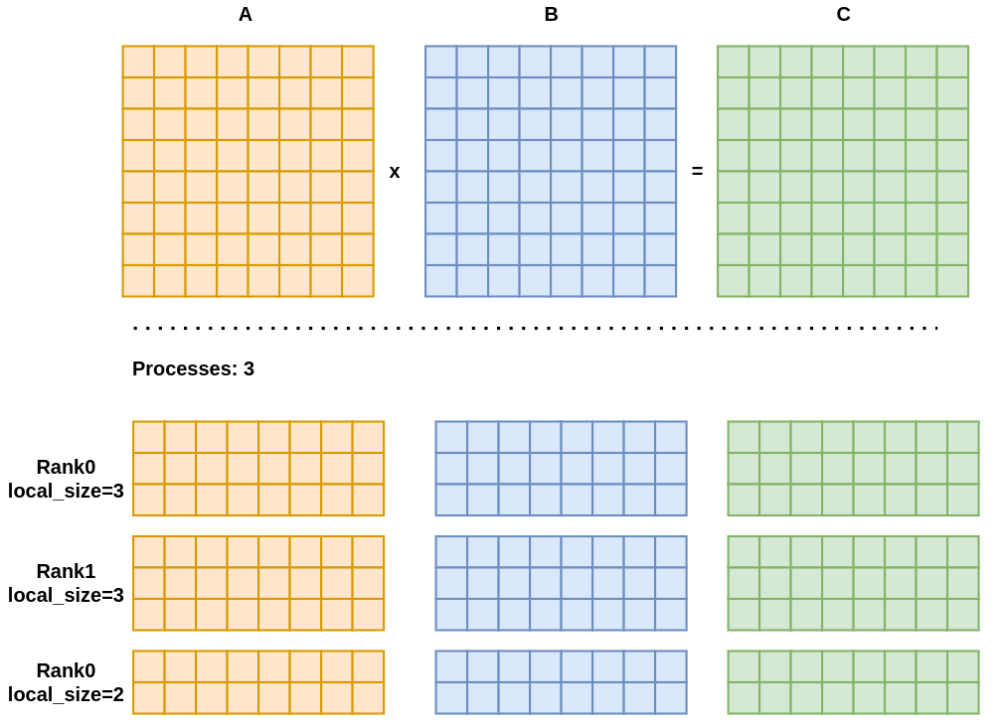
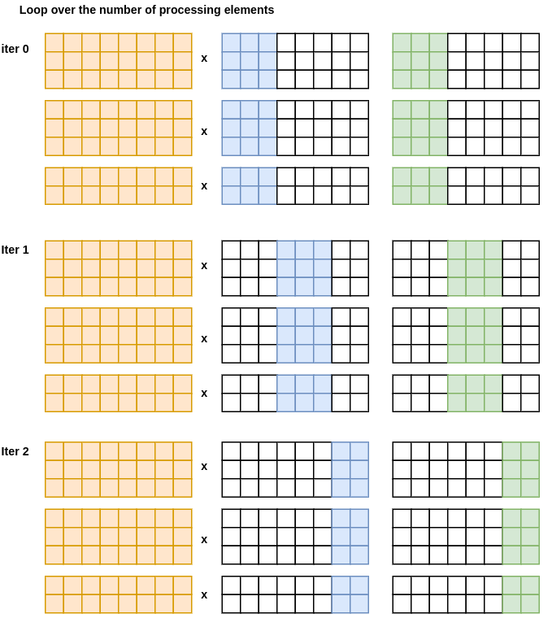
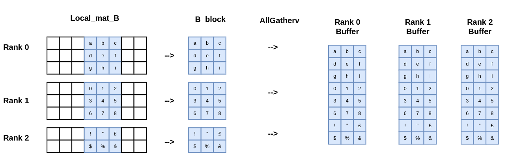
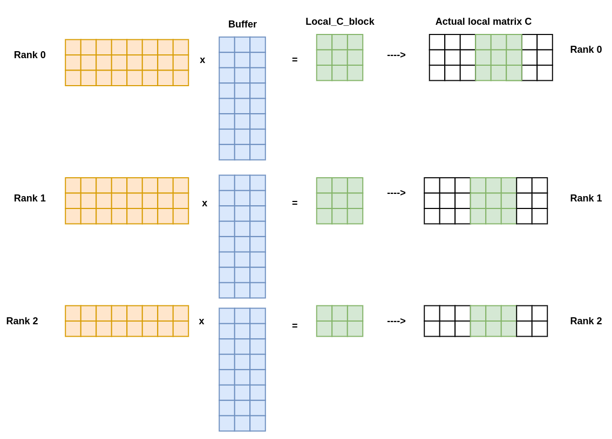

# Distributed Matrix-matrix multiplication

## Table of contents

- [Description](#description)
  * [Main idea](#main-idea)
  * [Implementation details](#implementation-details)

## Description

### Main idea

In this folder there is the code which implements the distributed matrix-matrix multiplication $A \times B = C$ with $A, B, C$ matrices of size $N \times N$.

All the matrices are distributed among the processing elements as represented in the following figure:

<figcaption>Figure 1: Example of 3 matrices of size 8x8 distributed among 3 processing elements</figcaption>

The main idea is performing a `for` loop cycle over the number of processing elements, and at each iteration, gathering a block of columns of the matrix $B$ in order to compute the local portion of the matrix $C$.


<figcaption>Figure 2: Representation of the main loop of the algorithm. Since both the size of the matrix and the number of processing can be anything, the number of elements in each block that is gathered can be different.</figcaption>



<figcaption>Figure 3: Representation of how each process extract its own portion of the matrix B, and how it is passed to all the other processes with an AllgatherV operation and stored in a buffer.</figcaption>


<figcaption>Figure 4: During the computation of the local portion of the matrix C, each process first compute the block of the global result. Then it is copied to the proper memory location in the global matrix C.</figcaption>

### Implementation details

The code is implemented using the `C` programming language and the `MPI` library for the communication between the processing elements.

The product of the matrices is computed in 3 different ways:

- **Naive**: the product is computed using the standard triple nested loop.
- **BLAS**: the product is computed using the `dgemm` function of the `BLAS` library.
- **CUDA**: the product is computed using the `cublasDgemm` function of the `CUBLAS` library.


**Observation**: There are some assumptions to make this algorithm work:

- Each process has enough memory to store the local portion of the matrices.
- This mean that at least every process should be able to store at list $\ \simeq 3N$ elements
- The number of processing elements is much smaller than the size of the matrix $N$.
- The number of processing is enough to store the entire matrices $A$, $B$ and $C$.

## How to compile and run the code 

The provided [`Makefile`](./Makefile) can be used to compile the code. The following commands can be used to compile the code:

- `make` to compile the code using the *naive* 3 nested loop implementation.
- `make blas` to compile the code using the *BLAS* implementation.
- `make cuda` to compile the code using the *CUDA* implementation.

Then the compiled code can be run using the following command:

```bash
mpirun -np <number_of_processes> ./main <matrix_size> 
```
The provided [`sbatcher.sh`](./sbatcher.sh) script can be used as example to write a SLURM script to run the code on your available cluster. It was used to run the code on the [Leonardo cluster](https://leonardo-supercomputer.cineca.eu/).


***Remark***: For how the code is implemented, the more convenient way to allocate resource is: 

- In the case of *naive* and *BLAS* implementation: 
  - 1 process per node
  - asking as many cores as the number of GPUs in the node (they are going to be used to spread omp threads)
- In case of *CUDA* implementation:
  - `<n_gpu_per_node>` processes per node
  - giving <total_core % n_gpu_per_node> cores to each process
  - asking the entire amount of GPUs in the node
  - In this way every process will have a GPU to work with.


[//]: # ()
[//]: # (- - -)

[//]: # (TODO: delete all this part below)

[//]: # ()
[//]: # ()
[//]: # (:> [!WARNING])

[//]: # (> REAMRK: at the moment this readme are just the note that I took during the lecture in which professor assigned the exercise. )

[//]: # (> It is going to be re-written as soon as possible)

[//]: # ()
[//]: # ()
[//]: # (***Remark***: This exercise will be part of the exam.)

[//]: # ()
[//]: # (We are going to parallelize a code that implements the matrix-matrix multiplication distributely )

[//]: # ()
[//]: # ($$)

[//]: # (A \times B = C)

[//]: # ($$)

[//]: # ()
[//]: # (where $A$ and $B$ are matrices and $C$ is the result of the multiplication..)

[//]: # ()
[//]: # ($$)

[//]: # (C_{ij} = \sum_{k=0}^{N} A_{ik} \times B_{kj})

[//]: # ($$)

[//]: # ()
[//]: # ()
[//]: # (Normally in code this is a three time nested loop: )

[//]: # ()
[//]: # (```c)

[//]: # (for &#40;int i = 0; i < N; i++&#41;)

[//]: # ({)

[//]: # (    for &#40;int j = 0; j < N; j ++&#41;)

[//]: # (    {)

[//]: # (        for &#40;int k = 0; k < N; k++&#41;)

[//]: # (        {)

[//]: # (            C[i, j] += A[i, k] * B[k, j];)

[//]: # (        })

[//]: # (    })

[//]: # (})

[//]: # (```)

[//]: # ()
[//]: # ()
[//]: # (But now we are in a setting with the data are distributed among different processes...)

[//]: # (There are many algorithms, the one we are going to implement is not the fastes in the world, but is a good compromise between simplicity of implementation and performance.)

[//]: # ()
[//]: # ()
[//]: # (Instead of gathering one single column and computing one single element of $C$ for all gather, we can gather a block of columns &#40;size: $N \times n_{loc}$&#41;.)

[//]: # ()
[//]: # (In this way instead of doing an allghater for each column, the total of allgather operation is reduced to $N/n_{loc} = $ number of processing elements.)

[//]: # ()
[//]: # ()
[//]: # (Of course this algorithm works better if the number of processing elements is much smaller than the size of the matrix $N$.)

[//]: # ()
[//]: # ()
[//]: # (note: $T_{communication} = T_{initialization} + T_{data\_transfer}$. )

[//]: # ()
[//]: # ()
[//]: # (**Unfortunatly** there is a big complication: at the end of the day, every local processes has to compute locally his local portion of C &#40;local parto fo B times all the portion of B&#41;.  The elements we are selecting are not contiguos in memory.)

[//]: # ()
[//]: # ()
[//]: # (```)

[//]: # (P0              B)

[//]: # (    +--------+------+--------+             +-------+)

[//]: # (    |        |\\\\\\|        |     -->     |\\\\\\\|)

[//]: # (    |        |\\\\\\|        |             |\\\\\\\|)

[//]: # (    +--------+------+--------+             +-------+)

[//]: # ()
[//]: # (P1              B)

[//]: # (    +--------+------+--------+             +-------+)

[//]: # (    |        |\\\\\\|        |     -->     |\\\\\\\|)

[//]: # (    |        |\\\\\\|        |             |\\\\\\\|)

[//]: # (    +--------+------+--------+             +-------+)

[//]: # ()
[//]: # ()
[//]: # ()
[//]: # (Pn              B)

[//]: # (    +--------+------+--------+             +-------+)

[//]: # (    |        |\\\\\\|        |     -->     |\\\\\\\|)

[//]: # (    |        |\\\\\\|        |             |\\\\\\\|)

[//]: # (    +--------+------+--------+             +-------+)

[//]: # ()
[//]: # (```)

[//]: # ()
[//]: # ()
[//]: # ()
[//]: # (- - -  )

[//]: # ()
[//]: # (Steps in pseudocode:)

[//]: # ()
[//]: # (```)

[//]: # ()
[//]: # (t0)

[//]: # (Allocation of distributed data)

[//]: # (t1)

[//]: # (Initialization of A and B &#40;randomly&#41;)

[//]: # (t2)

[//]: # (for &#40;count = 0; c < Npes< coutn ++&#41;{ // loop over the number of processing elements)

[//]: # (    t3)

[//]: # (    create_block &#40;B, block&#41;             // create a block of columns)

[//]: # (    t4)

[//]: # (    ALL_GATHER&#40;block, n_loc*n_loc, ...&#41; // gather the block of columns, B_colum is the receiving buffer)

[//]: # (    t5)

[//]: # (    MAT_MUL&#40;A, B_colum, C_loc&#41;          // compute the local portion of C)

[//]: # (    t6)

[//]: # (    )
[//]: # (})

[//]: # (print C // to check the result, to print it we have to collect all the local portions of C before)

[//]: # (```)

[//]: # ()
[//]: # ()
[//]: # ()
[//]: # ()
[//]: # (```)

[//]: # (                A                   B_column                    C )

[//]: # (P_x     +-------------------+      +--------+     *-  -  -  -  +--------+ -  -  -  -  - +)

[//]: # (        |                   |  x   |\\\\\\\\|     |            |\\\\\\\\|               |)

[//]: # (        |                   |      |\\\\\\\\|     |            |\\\\\\\\|               |)

[//]: # (        +-------------------+      +--------+     *-  -  -  -  +--------+ -  -  -  -  - +)

[//]: # (```)

[//]: # ()
[//]: # ()
[//]: # ()
[//]: # ()
[//]: # (We are required to produce a stacked chart about the time spent in the different parts of the code to compare the time of the parallel portion of the code with the serial one.)

[//]: # ()
[//]: # ()
[//]: # (```)

[//]: # (\\\\\ --> serial code)

[//]: # (///// --> parallel code)

[//]: # ()
[//]: # ()
[//]: # (      +-----+)

[//]: # (      |\\\\\|)

[//]: # (      |\\\\\|)

[//]: # (      +-----+)

[//]: # (      |/////|)

[//]: # (      |/////|        +-----+)

[//]: # (      |/////|        |\\\\\|)

[//]: # (      |/////|        +\\\\\|)

[//]: # (      |/////|        +-----+)

[//]: # (      |/////|        |/////|)

[//]: # (---------------------------------------------)

[//]: # (       1 processe    N processes)

[//]: # (```)

[//]: # ()
[//]: # ()
[//]: # ()
[//]: # ()
[//]: # (Note, the plot can have more stack, to delineate each part of the code how it acts)

[//]: # ()
[//]: # ()
[//]: # ()
[//]: # ()
[//]: # ()
[//]: # (2 VERSIONS OF THE CODE: )

[//]: # ()
[//]: # (- V1---> Naive Mat_mul implementation with the 3 nested loops)

[//]: # (- V2---> Mat_mul  implementatio used with the dgemm function of blas)

[//]: # ()
[//]: # ()
[//]: # ()
[//]: # (And this is only for the CPU part. )

[//]: # ()
[//]: # (In this course we want to use also the GPU pats. )

[//]: # ()
[//]: # ()
[//]: # (new pseudocode:)

[//]: # ()
[//]: # (```)

[//]: # (- ALLOCATION OF DISTRIBUTED DATA ON CPU )

[//]: # ()
[//]: # (- CUDAMEMCPY FROM CPU TO GPU  &#40;A  Cpu --> GPU &#41; )

[//]: # ()
[//]: # (- for &#40;c = 0, c < Npes, c++&#41;{)

[//]: # (    - create_block )

[//]: # (    - ALL_GATHER)

[//]: # (    - SET_DEVICE&#40;...&#41;)

[//]: # (    - CUDAMEMCPY FROM CPU TO GPU &#40;B_colum CPU --> GPU&#41;)

[//]: # (    - Mat_mul_GPU)

[//]: # (})

[//]: # (- CUDAMEMCPY FROM GPU TO CPU &#40;C GPU --> CPU&#41;)

[//]: # ()
[//]: # ()
[//]: # (- PRINT C)

[//]: # (```)

[//]: # ()
[//]: # ()
[//]: # (`CUDA_SET_DEVICE&#40;&#41;`  takes a input a number and set the GPU with that number as the current device.)

[//]: # (in this way if we have more than one GPU we can select the one we want to use. tipically use in a node is `CUDA_SET_DEVICE&#40;RANK % N_GPUS_IN_NODE&#41;`)

[//]: # ()
[//]: # ()
[//]: # (In this case the Matrix_multiplication will be done using the `cublasDgemm` function of the CUBLAS library. &#40;the prof said that is usless to implement the matrix multiplication on the GPU by ourself, the library is optimized and we can use it&#41;)

[//]: # ()
[//]: # ()
[//]: # ()
[//]: # (Note: in the dgem interface there is a LDC parameters which stands for the leading dimension of the matrix. This is in our case $N$, because the matrix is stored in a linear array.)

[//]: # ()
[//]: # (while the CUBLAS library considered the matrix as a column major matrix, so the leading dimension is the number of rows of the matrix. )

[//]: # ()
[//]: # ()
[//]: # (`CUDA-AWARE MPI` is a feature of the MPI library that allows to pass directly the GPU memory to the MPI functions. This is useful because we can avoid the copy of the data from the GPU to the CPU and then to the other GPU.)

[//]: # ()
