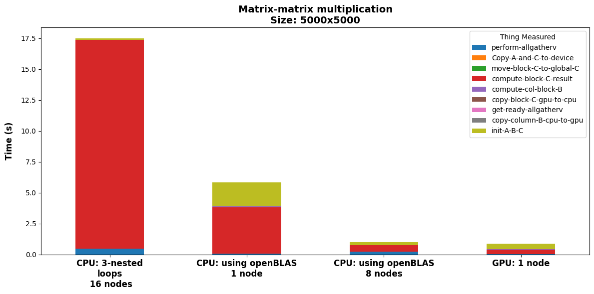

# Distributed Matrix-matrix multiplication

## Table of contents

- [Description](#description)
  * [Main idea](#main-idea)
  * [Implementation details](#implementation-details)
- [How to compile and run the code](#how-to-compile-and-run-the-code)
- [Results](#results)

## Description

### Main idea

In this folder there is the code which implements the distributed matrix-matrix multiplication $A \times B = C$ with $A, B, C$ matrices of size $N \times N$.

All the matrices are distributed among the processing elements as represented in the following figure:

<figcaption>Figure 1: Example of 3 matrices of size 8x8 distributed among 3 processing elements</figcaption>

The main idea is performing a `for` loop cycle over the number of processing elements, and at each iteration, gathering a block of columns of the matrix $B$ in order to compute the local portion of the matrix $C$.


<figcaption>Figure 2: Representation of the main loop of the algorithm. Since both the size of the matrix and the number of processing can be anything, the number of elements in each block that is gathered can be different.</figcaption>


<figcaption>Figure 3: Representation of how each process extract its own portion of the matrix B, and how it is passed to all the other processes with an AllgatherV operation and stored in a buffer.</figcaption>


<figcaption>Figure 4: During the computation of the local portion of the matrix C, each process first compute the block of the global result. Then it is copied to the proper memory location in the global matrix C.</figcaption>

### Implementation details

The code is implemented using the `C` programming language and the `MPI` library for the communication between the processing elements.

The product of the matrices is computed in 3 different ways:

- **Naive**: the product is computed using the standard triple nested loop.
- **BLAS**: the product is computed using the `dgemm` function of the `BLAS` library.
- **CUDA**: the product is computed using the `cublasDgemm` function of the `CUBLAS` library.


**Observation**: There are some assumptions to make this algorithm work:

- Each process has enough memory to store the local portion of the matrices.
- This mean that at least every process should be able to store at list $\ \simeq 3N$ elements
- The number of processing elements is much smaller than the size of the matrix $N$.
- The number of processing is enough to store the entire matrices $A$, $B$ and $C$.

## How to compile and run the code 

The provided [`Makefile`](./Makefile) can be used to compile the code. The following commands can be used to compile the code:

- `make` to compile the code using the *naive* 3 nested loop implementation.
- `make blas` to compile the code using the *BLAS* implementation.
- `make cuda` to compile the code using the *CUDA* implementation.

Then the compiled code can be run using the following command:

```bash
mpirun -np <number_of_processes> ./main <matrix_size> 
```
The provided [`sbatcher.sh`](./sbatcher.sh) script can be used as example to write a SLURM script to run the code on your available cluster. It was used to run the code on the [Leonardo cluster](https://leonardo-supercomputer.cineca.eu/).


***Remark***: For how the code is implemented, the more convenient way to allocate resource is: 

- In the case of *naive* and *BLAS* implementation: 
  - 1 process per node
  - asking as many cores as the number of CPUs in the node (they are going to be used to spread omp threads)
- In case of *CUDA* implementation:
  - `<n_gpu_per_node>` processes per node
  - giving <total_core % n_gpu_per_node> cores to each process
  - asking the entire amount of GPUs in the node
  - In this way every process will have a GPU to work with.

## Results

<br><br>

<br><br>

<br><br>

<br><br>

<br><br>

<br><br>

<br><br>